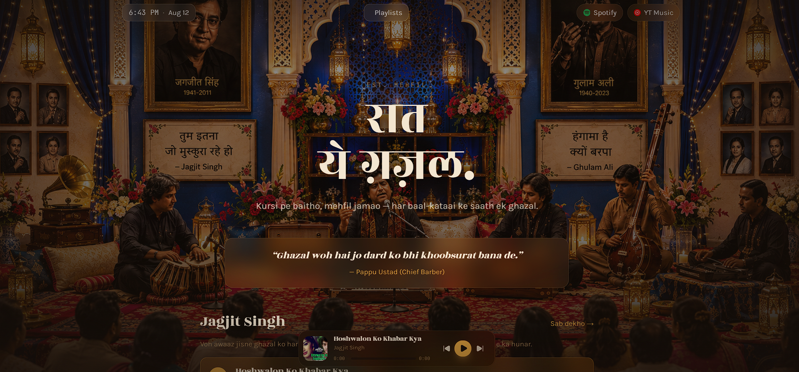

<div align="center">



# 🪷 Delux Gazhal

### *Kursi pe baitho, mehfil jamao — har ghazal ke saath ek yaadgar shaam.*

**A ghazal player, built like a digital mehfil.**

[](https://react.dev)
[](https://vitejs.dev)
[](https://tailwindcss.com)
[](https://developers.google.com/youtube/iframe_api_reference)

</div>

---

## ✨ About

**Delux Gazhal** is a warm, lantern-lit tribute to the legends of ghazal — Jagjit Singh, Ghulam Ali, and the mehfils they built. It's not just a music player; it's a *vibe*: rotating couplets and quotes, curated playlists, and every track playing like it's part of the evening's mehfil.

> *"Har ghazal ek kahani hai, bas sunne ka sabr chahiye."*

Built with a hidden YouTube player driving a fully custom UI — floating player bar, rotating quotes, curated playlists, and artist pages — all wrapped in a warm, ornate, lantern-and-velvet aesthetic.

---

## 🎧 Features

- 🎙️ **Custom Player Bar** — persistent floating bar with play/pause, next/prev, and scrub, powered by a hidden YouTube iframe
- 📜 **Rotating Quotes** — ghazal couplets and one-liners that cycle on the home screen
- 🗂️ **Playlists & Artists** — curated collections with dedicated detail pages
- 🖼️ **Custom Mehfil Backdrop** — drop in your own themed image, zero code changes needed
- ⚡ **Vite-powered** — instant dev server, lightning-fast builds
- 🎨 **Tailwind CSS v4** — utility-first styling, fully responsive

---

## 🚀 Getting Started

```bash
# install dependencies
npm install

# start the dev server
npm run dev
```

### 🖼️ Add your background image

Drop your ghazal-themed image here — the layout picks it up automatically:

```
public/images/mehfil-bg.jpg
```

### 📦 Build for production

```bash
npm run build
```

Output lands in `dist/`.

---

## 📁 Project Structure

```
delux-gazhal/
├── public/
│   └── images/
│       └── mehfil-bg.jpg         # your mehfil backdrop
│
├── src/
│   ├── components/
│   │   ├── PlayerBar.jsx         # floating player bar + controls
│   │   └── QuoteCard.jsx         # rotating ghazal quotes
│   │
│   ├── context/
│   │   └── PlayerContext.jsx     # global YouTube player state
│   │
│   ├── data/
│   │   └── tracks.js             # tracks, playlists, artists, quotes
│   │
│   ├── pages/
│   │   ├── Home.jsx
│   │   ├── Playlists.jsx
│   │   ├── Artists.jsx
│   │   ├── About.jsx
│   │   └── ...                   # detail pages
│   │
│   ├── App.jsx
│   └── main.jsx
│
├── .gitignore
├── .oxlintrc.json
├── index.html
├── package.json
├── package-lock.json
├── vite.config.js
└── README.md
```

---

## 🎼 Adding a Track

Add an entry to `tracks` in `src/data/tracks.js` with a real YouTube `videoId`:

```js
{
  id: "hoshwalon-ko-khabar-kya",
  title: "Hoshwalon Ko Khabar Kya",
  artist: "Jagjit Singh",
  videoId: "YOUTUBE_VIDEO_ID",
}
```

Then reference its `id` inside any playlist's or artist's `trackIds` array.

---

## 🕯️ Tech Stack

| Layer | Tech |
|---|---|
| UI | React 18 |
| Build Tool | Vite |
| Styling | Tailwind CSS v4 |
| Playback | YouTube IFrame API |
| State | React Context |

---

<div align="center">

*Ek mehfil, ek ghazal, ek haircut ke waqt.*

</div>